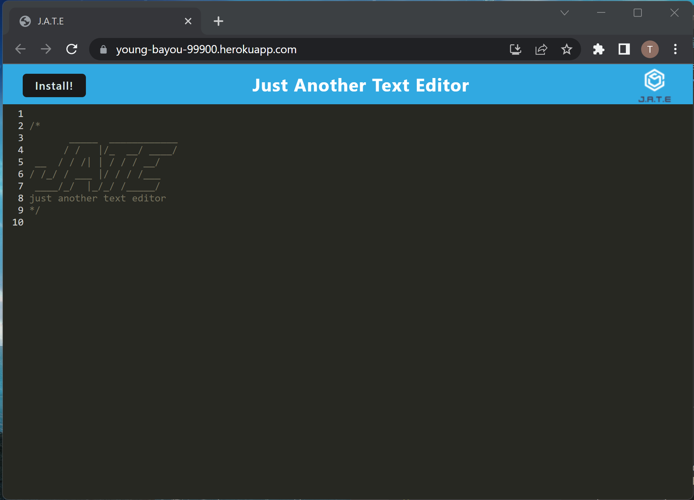
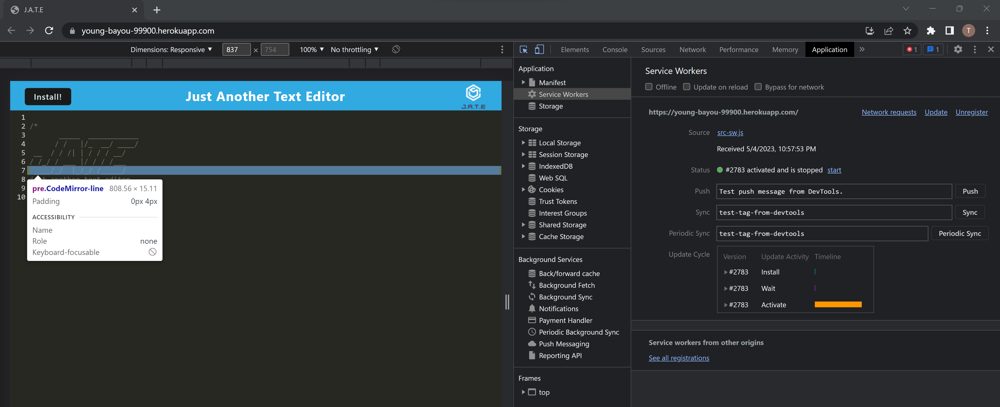
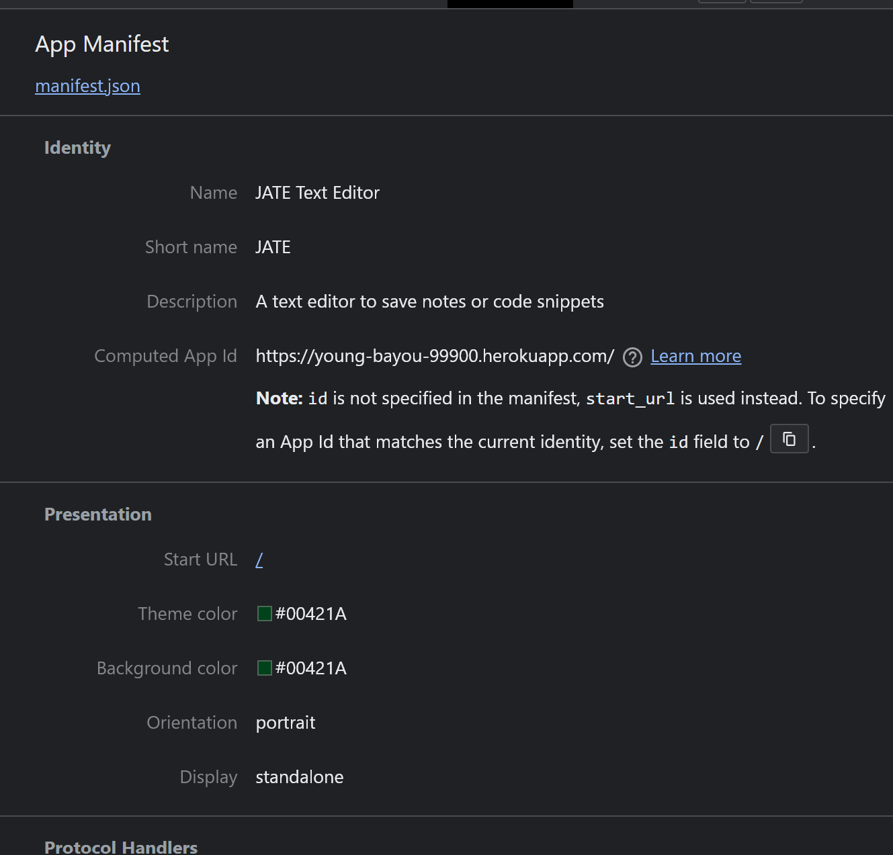

# Text Editor: JATE

## Table of Contents
  * [Description](#description)
  * [Installation](#installation)
  * [Usage](#usage)
  * [Licenses](#license)
  * [Contributing](#contributing)
    
## Description
This is a text editor application that anyone can use as a tool to save their working codes. The user will be able to use this tool on the web or offline and installed into their computer. 

## Installation
Open the application on a browser and click the install button. You will find your newly installed app in your homepage/desktop called JATE. Or just save the web URL into your bookmarks.

## Usage
Deployed link: https://young-bayou-99900.herokuapp.com/

## License
Unlicensed

## Contributing
Feel free to clone or fork the repo and create any changes you wish to make the application better!
